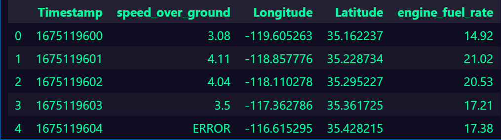
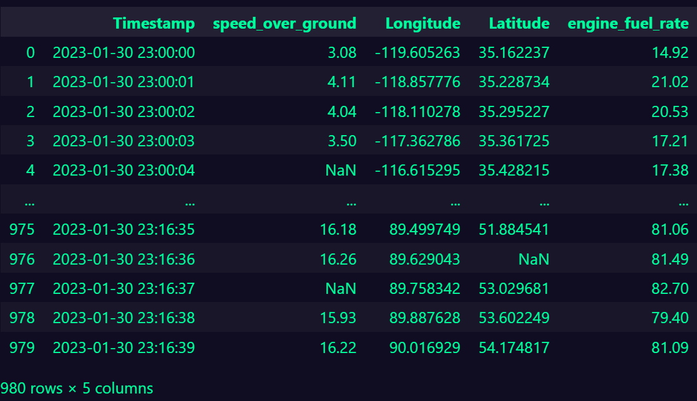
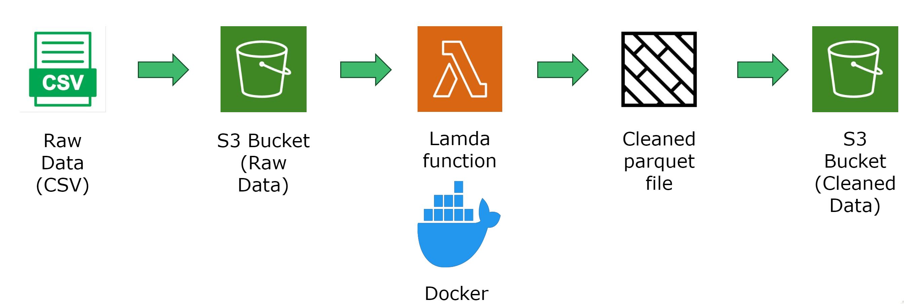

# CSV to Parquet pipeline using Amazon Web services.

This is a project to create a pipeline using a Lambda process within Amazon Web services (AWS) that will take a csv file from an S3 bucket apply a cleaning process to the data and then save as parquet format to another S3 bucket.

## Dummy Data

I began the project by creating a dummy dataset that had noticeable errors within the data. This was good practice to create dummy data and to be able to create bad data that would be cleaned and converted within the data processing stage. The development of my dummy data frame can be found in the ```dummy_data/dummy_data.ipynb``` jupyter notebook.

Here is an example of the Dummy data before processing:

<div align="center">
     
</div>

I will briefly explain what the columns mean and what kind of bad data I included within them: 

- Timestamp: The timestamp is a Unix timestamp (https://www.unixtimestamp.com/). This is the format that the vessel registers time information. It is ten digits long with every entry. I made sure to include such errors as digits that were less than or more than ten digits, NaN values and string values.  

- Speed over ground: This column had a range between 0 to 10 for its standard. I included numbers that were out of the range. For example, minus numbers and numbers over 10. I also included NaN values and string values.  

- Longitude and Latitude: The same process was applied to these columns as with the speed over ground column. The difference was that the ranges were not the same. Longitude has a range between –180 and 180.  Latitude has a range between –90 and 90. I ensured that I added numbers out of these ranges. Nan values and string values were also applied. 

- Engine fuel rate: Again, this column had the same process as speed over ground, Longitude and Latitude columns. The range was between 0 and 100. Numbers were added out of this range in minus and positive form. NaN values and string values were also applied.

## Data processing

The next stage of the process was to create functions within python that would be used to clean the dummy DataFrame and then convert the csv file to parquet format. The process can be found in the ```src/main_parquet.py```. The class is called CsvCleaner. Here is the data processing cleaning I applied: 

- Timestamp: Removed rows that were less than Unix timestamp from year of 2001, removed NaN values and string values. I removed them because if there is no time value, the other data stored will have no relevant time reference. It is very important to have a time reference linked to the other data points. This was also the case with any NaN and string values. Unix timestamp is also not readable for a human, so I had to convert this to a readable format in the form of Date time. This would give the year, month, day and the time up to every second. After this process was done, I then ordered the times in ascending order. 

- The remaining columns: I will not describe the rest of the column as I have done with the timestamp. This is because they all had the same process applied (using a function). The only difference is that the ranges of the data differed. I applied a process so that any numbers that lay outside of the columns range would be changed to a NaN value. The reason I changed the value to a Nan and not remove the row was because other columns could contain relevant data. I also made any values that were strings to be converted to a Nan for the same reasons.

Here is how the Dataset looked after cleaning: 

<div align="center">
     
</div>

## Parquet format

After the cleaning process I saved the data frame as a parquet file. But why do this? 

Parquet format stores data column-wise rather than row-wise, which improves compression efficiency and reduces storage space. This means that similar values are stored together, allowing for better compression ratios. Additionally, Parquet supports various compression algorithms, further minimizing storage costs.

Moreover, Parquet's ability to push down predicates enables queries to skip unnecessary data chunks during processing, leading to faster query performance and potentially reducing costs associated with data processing.

Overall, by efficiently storing and compressing data, as well as optimizing query processing, Parquet format offers significant cost savings and increased storage capacity compared to CSV. This is very effective for business as it could also save on clod storage costs as well.

You can also partition parquet files within the saving process. I also did this with the data by using the Datetime column to be able to separate and order the files by year, month and day. This makes querying and finding specific data easier and quicker.  

## The Pipeline:  

The next part of the project was to create a pipeline that would trigger this cleaning/conversion process when a file would be uploaded to cloud storage.  

I will be using Amazon Web Services to achieve this. Amazon offers many different services that can be used to streamline your work. 

I will be using three different services from Amazon. These include: 
- S3 object storage (https://docs.aws.amazon.com/s3/?icmpid=docs_homepage_featuredsvcs) 
- AWS ECR (https://docs.aws.amazon.com/AmazonECR/latest/userguide/what-is-ecr.html) 
- AWS Lambda (https://docs.aws.amazon.com/lambda/?icmpid=docs_homepage_featuredsvcs)

- Amazon S3: This is an object cloud storage. Data can be stored in buckets and can be uploaded and downloaded. In this project I will use two buckets. One for the uploaded CSV files and another to place the cleaned and converted parquet files. 

- AWS Elastic Container Registry: This is used to run and store Docker containers. I used Docker (https://docs.docker.com/) to contain my code with the relevant packages and scripts then inserted it within an AWS lambda function using ECR (Elastic Container Registry).  

- AWS Lamda: This service allows code to be run without having to run a server. It allows you to upload code that will handle the objective or task that you require. In this instance I needed it to run the code for uploading a CSV file from an S3 bucket, process the data, convert to parquet format and then return the parquet to another S3 Bucket.

Below is a flow of my pipeline:

<div align="center">
     
</div>

The Lambda function is triggered whenever a new file is uploaded to the S3 bucket which contains the raw data. This was achieved by using Event notifications within the properties of the S3 bucket (fig 3.4). Using the event type “put” ensures that when a new file is uploaded into the bucket it will then run the lambda function with the relevant code to process and convert to parquet. Then continue to store it within another bucket.

## Conclusion

This small project has given me a better understanding of how to create a useful pipeline to process and convert data file types. This process can now be built on so that it can be used to create a Data Lakehouse in which data can be queried when it is directly available. An interactive Dashboard using “Power BI” for example could then be used to access this data directly.

## What next?

How can I build upon this project? :

- I can use the pipeline on real data and see if it works well with the data processing techniques.
- Query from the data lakehouse from Power BI or another Business intelligence tool and visualize the data.

## About the Author

My name is Sam Glass and have been a student within AI and Machine Learning at IT Högskolan in Gothenburg, Sweden for the last two years. I am very enthusiastic about anything to do with AI and Data. Particularly I am interested in Data Engineering and its importance within the ever evolving area of AI. Please feel free to contact me about anything to do with this project. Suggestions, improvements and developments are always welcome.

